# CYBERDIAG : What is it ? How does it work ?

This app is used to create a first cyber-security diagnostic for compagnies or consultants working in insurance (for instance) and filling the surveys with the clients.

### How does it work ?

When you arrive on the app, you have to possibilities :
- You are already registered and you sign in
- You are not already registerd, and you create an account
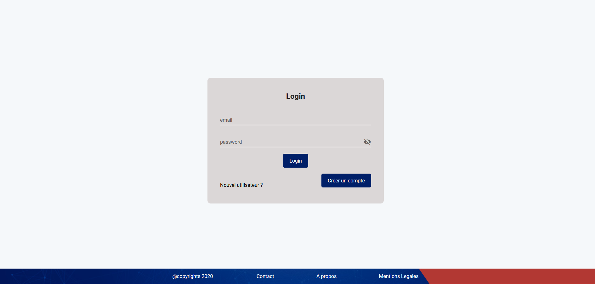

 Create an account 
Just clik on the button "Créer un compte" and the follow the different steps, that is to say fill the fields
- Firstname
- Lastname
- Company name
- Phone number (french format)
- Email 
- Password with security (12 caraters, one special, numbers and a Capital letter). If the two passwords are not the same, a modal will be opened to alert the error
- It is not possible to register if the user doesn't accept the legal terms (link to legal terms page)

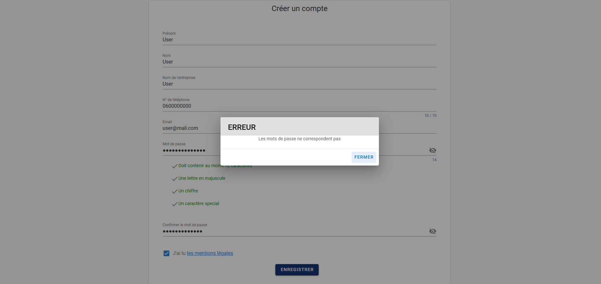


As the user click on the register button, there is modal to alert that an email is sent to confirm the account creation.
For now, the function is half usable because it wil not send a real email, but you have to check the backend console and click on the link in the console (more details on backend readme).


### User dashbaord
When a user is connected, he has an access to the homepage which is a dashboard with all the surveys he has filled (or nothing for the first connection).

To create a new survey, he has to click on the button "Nouveau questionnaire", which opens a new modal. Then he has to fill the different fields and register.
He will see the new survey title on his dashboard.
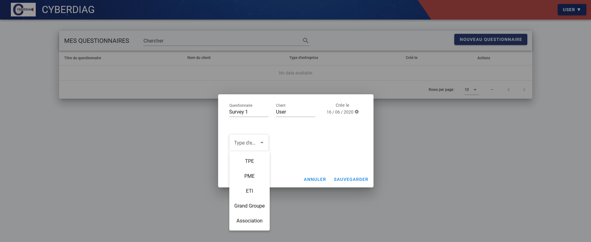

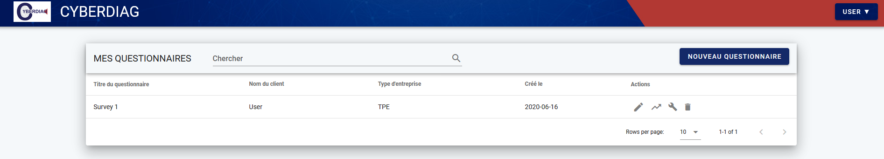

To begin the survey the user just created, he has to click on the pen button of the Actions column. 

The Actions column functions :
- Pen : fill the survey --> when the survey is already completed, the pen becomes a green check icon
- Break arrow : see charts page
- Wrench : change some details of the survey (title, client name, creation date, type of company)
- Trash : delete a survey and results


For the moment, only 2 types of companies have a survey model:
- TPE : the survey is good
- PME : the survey is fake (it allows to test the application)

### Admin dashboard

With an admin connection, the admin has a dashboard with all the users of the app.
For each one, he can add some comments by cliking on the pen option of the right. It will allow to have a tracking of the user : he has been phoned, he wants to be contacted, etc.

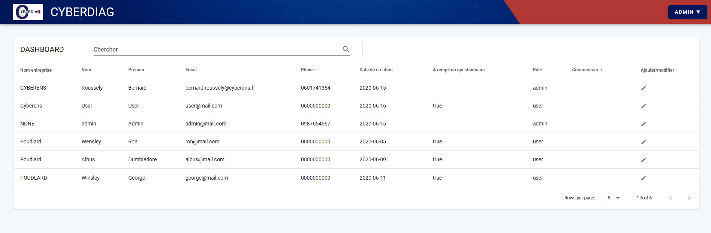
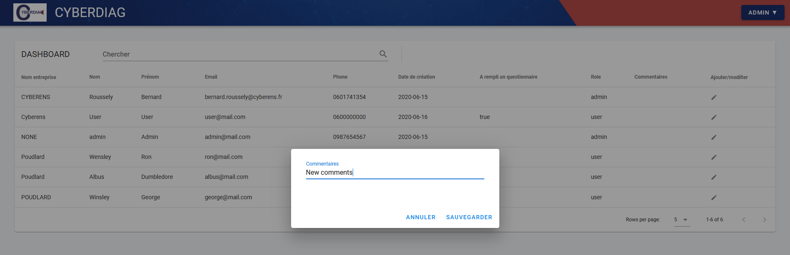

### Fill the survey

When the user attemps to the survey page, he will see the survey corresponding to his company type (TPE, PME, association, etc).

The different topics appear as cards to display. Just click on the first one and the questions will appear.

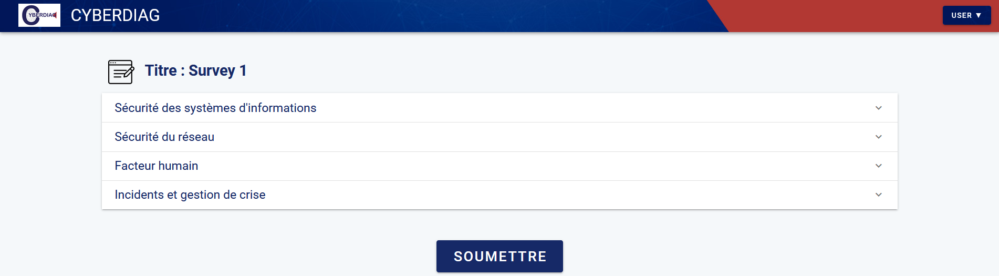

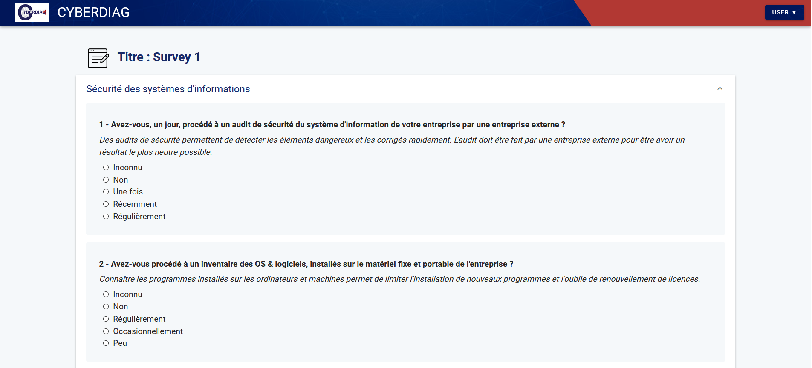

When the user has answered all the questions, jsut click on the submit button and he will be redirected to the charts page.
If he forgot to answer some questions, a modal will be opened to alert the question numbers no completed.

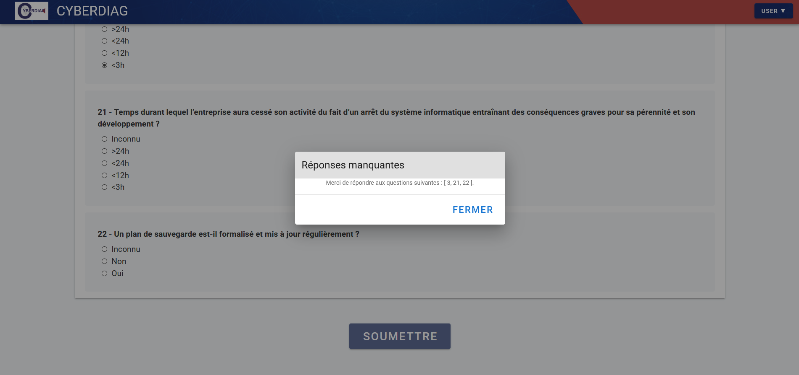

### Charts Page

The user can access to the charts page by two different ways:
- when submiting a new survey
- When cliking on the break arrow in dashboard

1. Radar chart
The user will see his results on a radar chart. THe blue line represents the maximum note he can obtain for each topic, and the green line represents his answers.

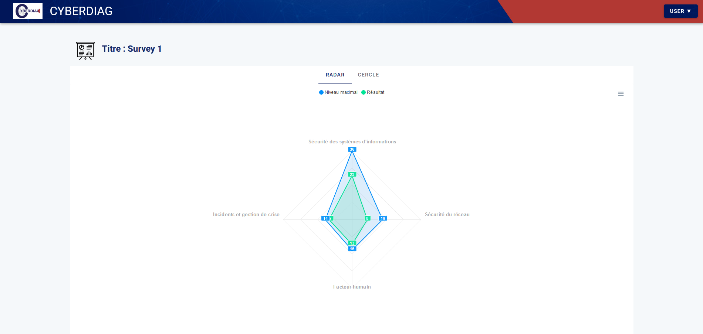

2. Radial chart
The user will see his results as a percentage of success for each topic.
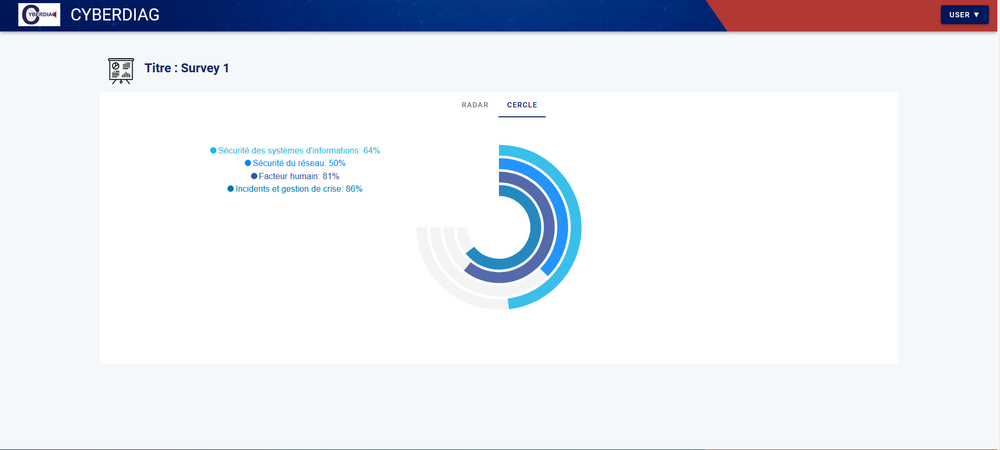

### Profile page

In the navbar, the user has access to the profile page as he clicks on the "Mon compte" option.
The he will have access to his personal details and is able to change somes (all execpt password).
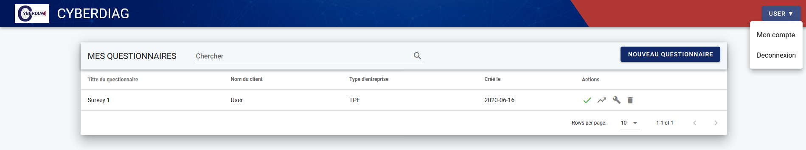

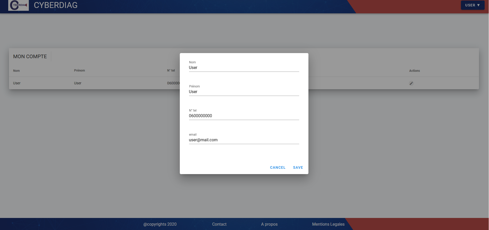


### Accounts connection

These are the logins you can use to connect to the app:
- As a user : user@mail.com // Password : Userconnect33!
- As an admin : admin@mail.com   // Passwrod : Adminconnect33!

## Database
A shema of database is available at cyberdiag app/DatabaseSchema.png
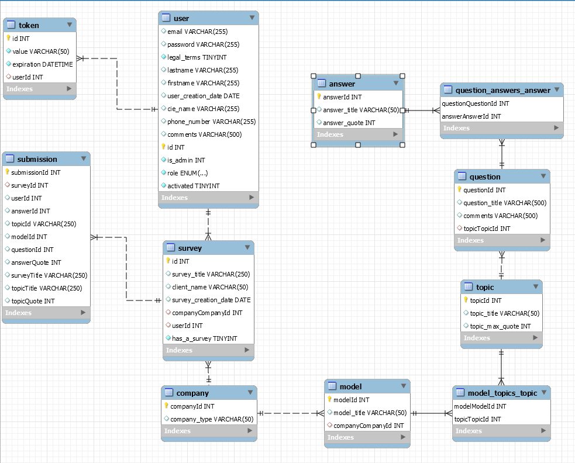

For the moment, only the company type "TPE" has a survey.
If a user selects another type of company when he creates a new survey, the survey page will be empty.

A file with all questions and answers of TPE company type survey is available at TPEModelSurvey.xls

II - NEXT FEATURES POSSIBLE
## Next possible features 
### As a user :
- Profile page : change password
- Charts page : send charts by email 
- About page to complete

### As an admin :
- Dashboard page : Don't display admin informations


### For all the app
- Perfect responsive css - responsivity for charts is not good
- Insert logo cleanly in navbar
- Insert more tests
- Add Night Mode


## TECH
Cyberdiag uses a number of open source projects to work properly :
 - [Vuejs](https://vuejs.org/)
 - [VueCli](https://cli.vuejs.org/)
 - [Vuetify](https://vuetifyjs.com/en/) 
 - [ApexCharts](https://apexcharts.com/) (to create charts)
 - [Jest](https://jestjs.io/)(to test the app)


### INSTALLATION AND RUN
## Project setup
```
npm install
```

### Compiles and hot-reloads for development
```
npm run serve
```

### Compiles and minifies for production
```
npm run build
```

### Lints and fixes files
```
npm run lint
```
### Test the application
```
npm run test:unit"
```

### Customize configuration
See [Configuration Reference](https://cli.vuejs.org/config/).


